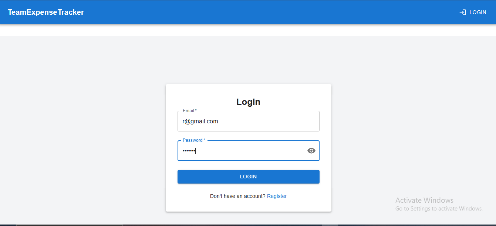
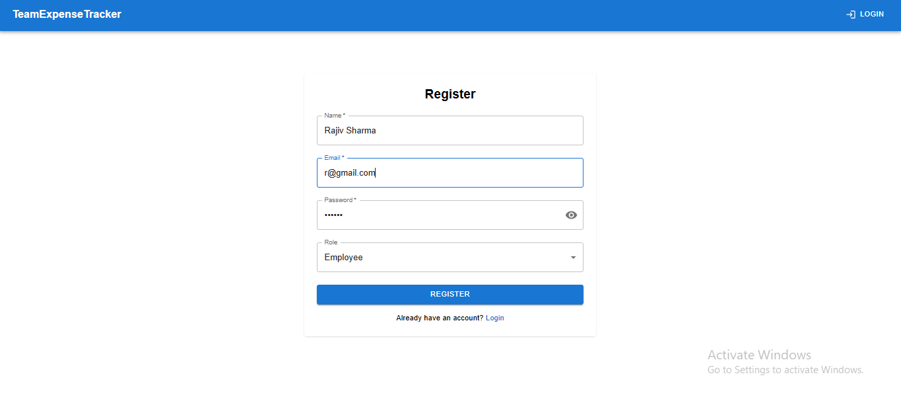
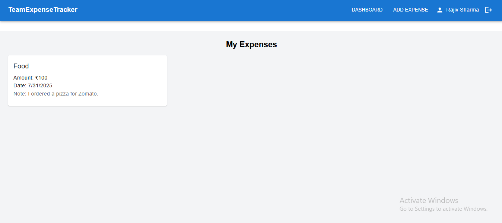
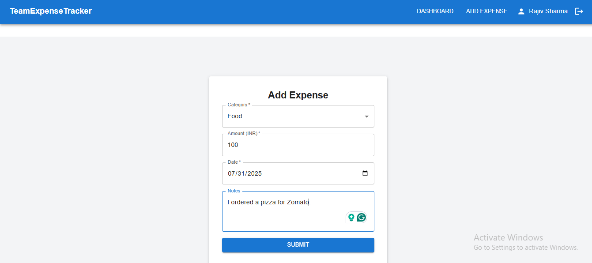
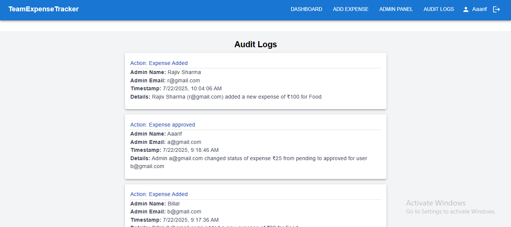
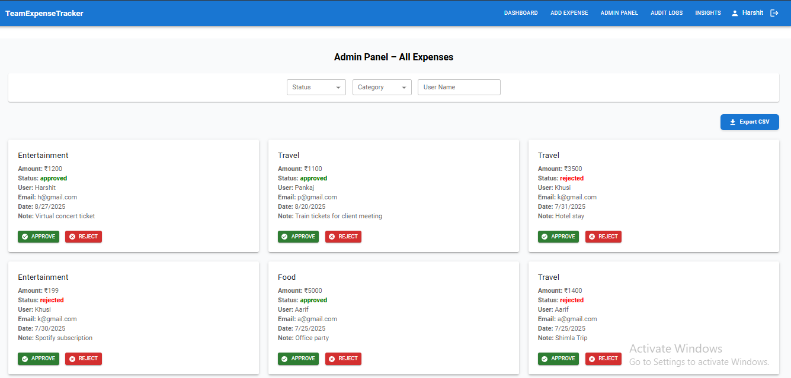
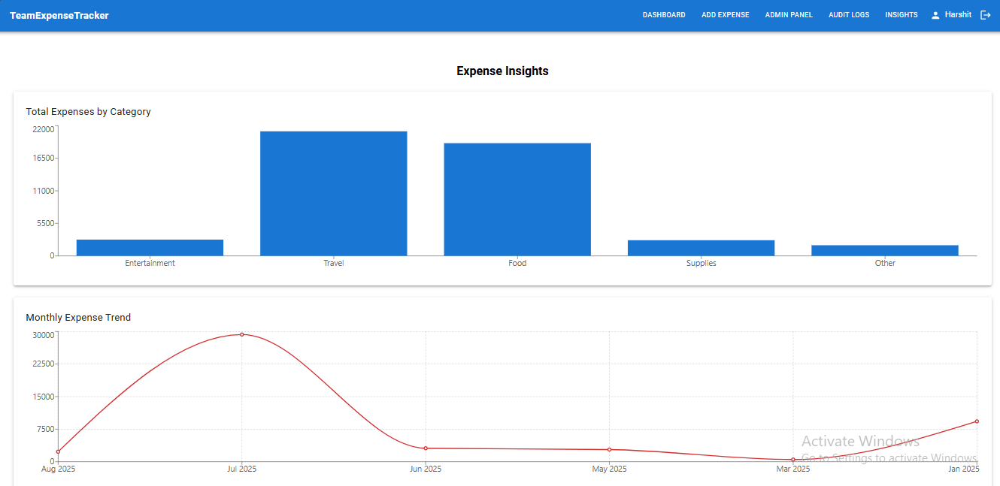

# Smart Expense Tracker & Analytics System 

A full-stack MERN application for managing and analyzing personal expenses. The system provides secure JWT authentication, role-based access control, expense management, monthly budget monitoring, threshold-based alerts, audit logging, and personalized spending insights.

---

##  Live Links

- 🔗 **Frontend (Vercel)**: [https://expense-tracker-topaz-six.vercel.app](https://expense-tracker-topaz-six.vercel.app)
- 🔗 **Backend (Render)**: [https://expense-tracker-ooym.onrender.com](https://expense-tracker-ooym.onrender.com)
- 🔗 **GitHub Repository**: [https://github.com/sharmaHarshit2000/expense-tracker](https://github.com/sharmaHarshit2000/expense-tracker)

---

##  Features

### Authentication & Authorization
- User Registration and Login
- JWT-based authentication
- Protected routes
- Role-based access control

### Expense Management
- Add, Edit, and Delete Expenses
- Filter expenses by date and category
- View recent and total expenses
- CSV export for administrators

### Budget Management
- Monthly budget tracking
- 80% budget warning
- 100% budget exceeded alert
- Budget utilization monitoring

### Analytics & Insights
- Category-wise spending analysis
- Monthly spending analytics
- Spending pattern analysis
- Personalized expense insights

### Audit & Administration
- Admin dashboard
- Audit log tracking
- User activity monitoring
- Role-based administrative access

---

##  Tech Stack

- **Frontend:** React.js, JavaScript, Axios
- **Backend:** Node.js, Express.js
- **Database:** MongoDB, Mongoose
- **Authentication:** JWT
- **Charts:** Recharts
- **Deployment:** Vercel, Render
- **Tools:** Git, GitHub, VS Code


---

## Project Structure

    expense-tracker/
    │
    ├── backend/
    │   ├── config/
    │   │   └── db.js
    │   │
    │   ├── controllers/
    │   │   ├── auditController.js
    │   │   ├── authController.js
    │   │   ├── budgetController.js
    │   │   └── expenseController.js
    │   │
    │   ├── middlewares/
    │   │   ├── authMiddleware.js
    │   │   ├── errorHandler.js
    │   │   └── notFound.js
    │   │
    │   ├── models/
    │   │   ├── AuditLog.js
    │   │   ├── Budget.js
    │   │   ├── Expense.js
    │   │   └── User.js
    │   │
    │   ├── routes/
    │   │   ├── auditRoutes.js
    │   │   ├── authRoutes.js
    │   │   ├── budgetRoutes.js
    │   │   └── expenseRoutes.js
    │   │
    │   ├── utils/
    │   │   └── generateToken.js
    │   │
    │   ├── package.json
    │   └── server.js
    │
    ├── frontend/
    │   ├── public/
    │   ├── src/
    │   │   ├── api/
    │   │   │   ├── audit.js
    │   │   │   ├── auth.js
    │   │   │   ├── axios.js
    │   │   │   ├── budget.js
    │   │   │   └── expense.js
    │   │   │
    │   │   ├── components/
    │   │   │   ├── Footer.jsx
    │   │   │   ├── Header.jsx
    │   │   │   ├── Loader.jsx
    │   │   │   └── ProtectedRoute.jsx
    │   │   │
    │   │   ├── context/
    │   │   │   └── AuthContext.jsx
    │   │   │
    │   │   ├── pages/
    │   │   │   ├── AdminPanel.jsx
    │   │   │   ├── AuditLogs.jsx
    │   │   │   ├── Dashboard.jsx
    │   │   │   ├── ExpenseForm.jsx
    │   │   │   ├── Insights.jsx
    │   │   │   ├── LoginPage.jsx
    │   │   │   ├── NotFound.jsx
    │   │   │   └── RegisterPage.jsx
    │   │   │
    │   │   ├── App.jsx
    │   │   ├── App.css
    │   │   ├── index.css
    │   │   └── main.jsx
    │   │
    │   ├── package.json
    │   ├── vercel.json
    │   └── vite.config.js
    │
    ├── screenshots/
    │   ├── admin-panel.png
    │   ├── audit-logs.png
    │   ├── dashboard.png
    │   ├── expenses.png
    │   ├── insight.png
    │   ├── login.png
    │   └── register.png
    │
    ├── .gitignore
    └── README.md


##  System Architecture


                    User
                      |
                      v
              React Frontend
                      |
                      | REST API / HTTP
                      v
              Express.js Backend
                      |
          +-----------+-----------+
          |           |           |
          v           v           v
       Routes     Middleware   Controllers
                                  |
                                  v
                               Models
                                  |
                                  v
                              MongoDB


---

## Application Flow

    User
    |
    +---- Register / Login
    |
    v
    JWT Authentication
    |
    v
    Dashboard
    |
    +----------------------+----------------------+
    |                      |                      |
    v                      v                      v
    Expense Management   Budget Monitoring    Analytics
    |                      |                      |
    v                      v                      v
    MongoDB              Alerts              Spending Insights
    |
    v
    Audit Logs
    |
    v
    Admin Panel

---

##  Getting Started

### 1. Clone the Repository

```bash
git clone https://github.com/ashishk72/Team-Expense-Tracking-Analytics-System
cd expense-tracker
```

### 2. Backend Setup

```bash
cd backend
npm install
```

Create a `.env` file in `backend/`:

```env
PORT=5000
MONGO_URI=your_mongo_db_uri
JWT_SECRET=your_jwt_secret
```

Start the backend:

```bash
npm run dev
```

### 3. Frontend Setup

```bash
cd frontend
npm install
```

Create a `.env` file in `frontend/`:

```env
VITE_API_BASE_URL=https://your-backend-service.onrender.com/api
```

Start the frontend:

```bash
npm run dev
```

---

##  Deployment

### Backend (Render):

- Connect GitHub repo
- Add Environment Variables (`MONGO_URI`, `JWT_SECRET`)
- Set build command: `npm install`
- Set start command: `node index.js` or `npm start`

### Frontend (Vercel or Render):

- Set `VITE_API_BASE_URL` to backend's deployed URL
- Set build command: `npm run build`
- Output directory: `dist` (for Vite)

---


##  Screenshots

 To view **Audit Logs** and **Admin Panel**, login as an **admin** user.

---

###  Login Page  


---

###  Register Page  


---

###  Dashboard  


---

###  Expenses  


---

###  Audit Logs  


---

###  Admin Panel  


---

###  Insights (Charts via Recharts)


---

##  Author

**Ashish Kumar**  
📧 ashishk07376@gmail.com   
🔗 [GitHub Profile](https://github.com/ashishk72)